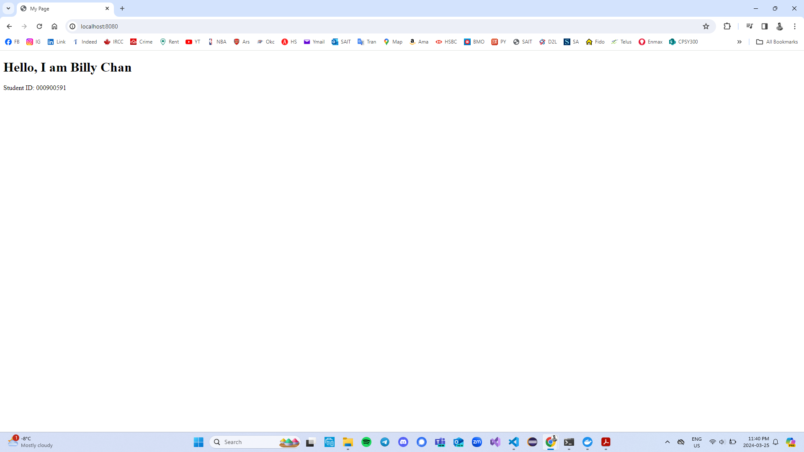
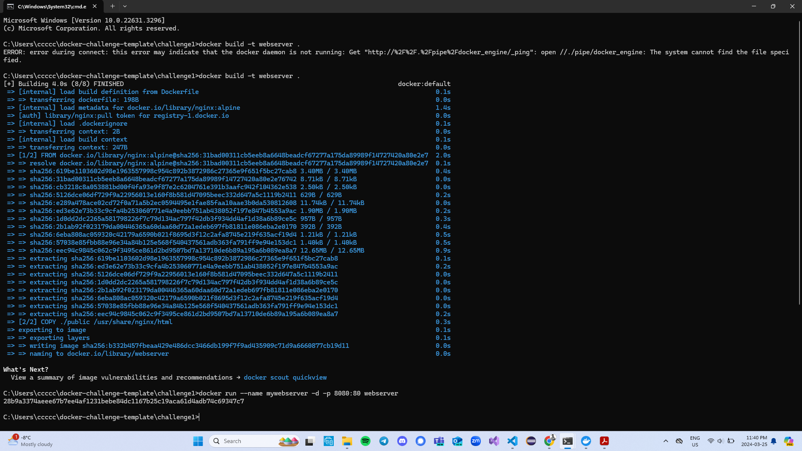
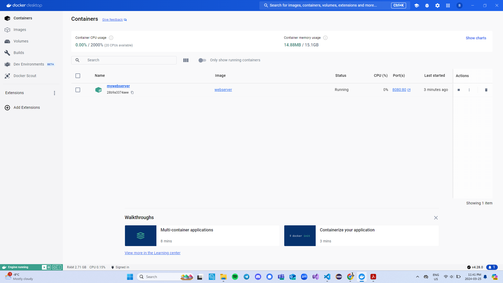
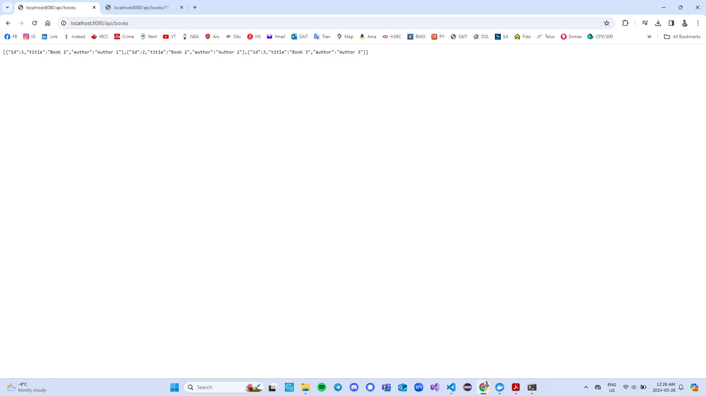
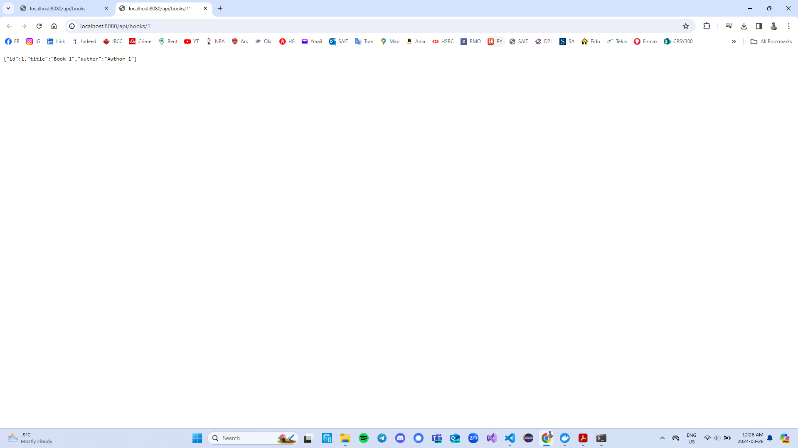
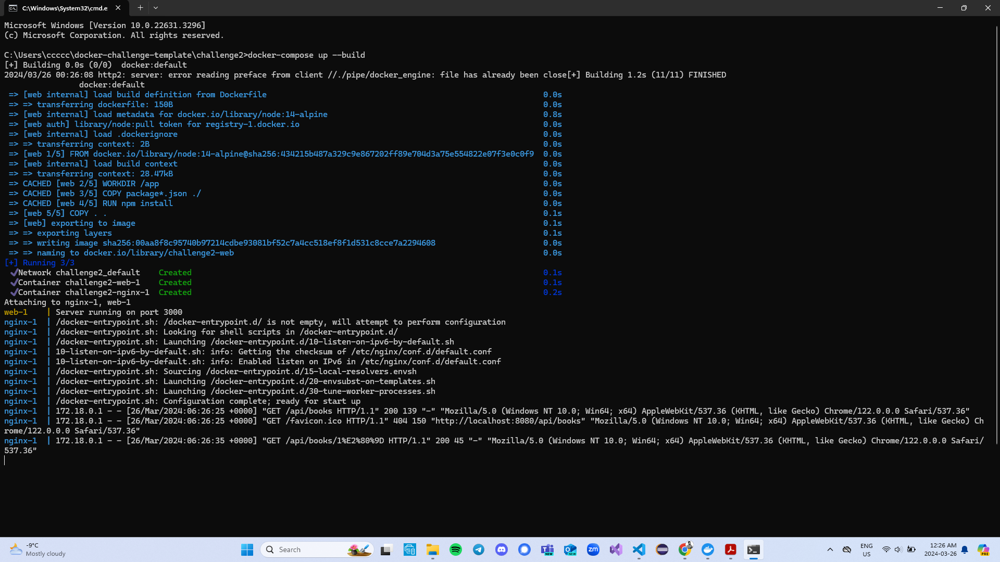
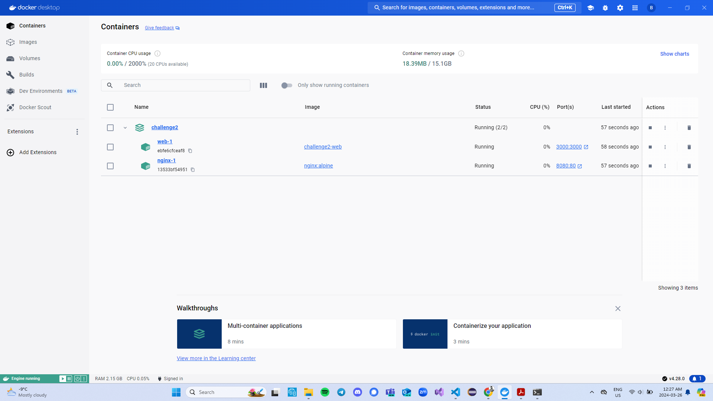

- Student Name: Billy Chan
- Student ID: 000900591

# Docker Challenge 1 Report

## Introduction
This report details my experience and learning process during Challenge 1 of our Docker project. The goal was to understand the basics of Docker, build a Docker image, and run a container to serve static web pages using Nginx.

## Procedure
1. Environment Setup:
- Installed Docker Desktop on Windows.
- Forked the necessary GitHub repository and cloned it to my local machine.

2. Creating the Webpage:
- Created a public folder inside the challenge1 directory.
- Added an index.html file with my personal details.

3. Preparing the Docker Environment:
- Wrote a Dockerfile to pull the nginx:alpine image and copy the contents of my public folder into /usr/share/nginx/html in the container.

4. Building the Docker Image:
- Ran docker build -t webserver . in the terminal within the challenge1 directory to build my Docker image.

5. Running the Container:
- Started the container using docker run --name mywebserver -d -p 8080:80 webserver.
- Ensured that the website was accessible by visiting http://localhost:8080 in a web browser.

6. Version Control:
- Used Git commands to add, commit, and push the Dockerfile and public folder to my GitHub repository.

## Results
Successfully accessed the static webpage served by the Docker container. Below are screenshots illustrating the process:

## Conclusion
This challenge provided a practical introduction to Docker, teaching me how to build an image, run a container, and serve static content using Nginx. I am looking forward to applying these skills in future projects and exploring more advanced Docker functionalities.

# Docker Challenge 2 Report

## Introduction
This report outlines the process followed to complete Challenge 2 of our Docker project. The primary goals were to utilize Docker Compose to run a dynamic NodeJS application and to understand how Docker can be used to orchestrate multi-container applications.

## Procedure
1. Preparing the Environment:
- Unzipped the provided challenge2.zip into the challenge2 folder, which contained the essential NodeJS application files: package.json, package-lock.json, and the server script.

2. Setting Up Dockerfile:
- Created a Dockerfile within the challenge2 directory to set up the NodeJS environment and copy the application files into the Docker container.

3. Configuring Docker Compose:
- Authored a docker-compose.yml file to define and run multi-container Docker applications, including the NodeJS app and an NGINX server to route external requests.

4. Building and Running Containers:
- Used Docker Compose commands to build and initiate the application and NGINX containers, ensuring inter-container communication and proper routing of requests.

5. Verifying Application Functionality:
- Tested the application by accessing endpoints via a web browser to confirm that the NodeJS application was correctly serving the expected JSON responses.

6. Version Control and Cleanup:
- Managed version control with Git for all changes made during the challenge, and performed cleanup activities to stop and remove Docker containers after verification.

## Results
Successfully accessed the dynamic NodeJS application responses served by the Docker container. Below are screenshots illustrating the outcomes:

## Conclusion
Through this challenge, I gained hands-on experience with Docker Compose and the orchestration of multi-container applications. I learned how to configure a Docker environment to run a dynamic NodeJS application and use NGINX as a reverse proxy to direct requests to the appropriate container. This project solidified my understanding of container-based application deployment and operational strategies.